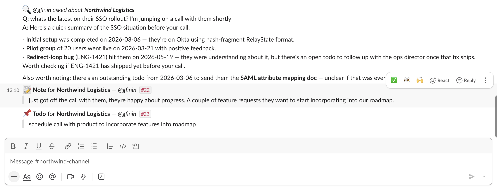

# cs-notes-bot

Slack bot that turns customer-success notes into a persistent, queryable
context layer instead of a sea of scattered Google Docs.

```
/csnote Spoke today, they're happy about the renewal.
/csnote todo Send the SAML attribute mapping doc.
/csnote ask What's the status of their SSO rollout?
/csnote recent
```



> **Note on this repo.** This is an anonymized portfolio version of a personal
> support-ops tool built around a real customer-success workflow. It runs
> end-to-end against SQLite and a seeded set of fictional customers. See
> [ARCHITECTURE.md](./ARCHITECTURE.md) for the deployment-vs-demo split.

## Why this exists

Customer notes at most B2B companies get scattered across Google Docs, Slack
DMs, and Notion pages. When a CSM leaves, the context goes with them. This
bot exists so notes are written *in the place they're generated* (the Slack
channel for that customer), persisted to a queryable store, and surfaceable
via LLM Q&A — *"what's the status of their SSO rollout?"*, *"have they
complained about exports before?"*

## Command surface

| Command | What it does |
| --- | --- |
| `/csnote <text>` | Save a note. Customer is auto-resolved from the channel name (e.g. `northwind-channel` → Northwind). |
| `/csnote customer <slug> <text>` | Save a note for an explicit customer when used outside a customer channel. |
| `/csnote todo <text>` | Same as above but saves as an action item. |
| `/csnote ask <question>` | Claude reads the full note history for this customer and answers the question. |
| `/csnote recent` | Last 5 notes for this customer. |

## Running it locally

```bash
python3 -m venv .venv && source .venv/bin/activate
pip install -r requirements.txt
cp .env.example .env       # then fill in SLACK_BOT_TOKEN, SLACK_APP_TOKEN, ANTHROPIC_API_KEY

# Seed the DB with fictional customers + a few months of notes
python -m scripts.seed_db

# Start the bot (Socket Mode — no public URL needed)
python -m src.csnote.app
```

Then in your Slack workspace, type `/csnote ask What's going on with Northwind?`
in any channel and the seeded data drives the response.

## Slack app setup

1. Create an app at https://api.slack.com/apps → *From scratch*
2. **Socket Mode** → enable. Generate an App-Level Token with the
   `connections:write` scope → save as `SLACK_APP_TOKEN`.
3. **OAuth & Permissions** → Bot Token Scopes: `commands`, `chat:write`. Install
   to workspace → copy the bot token (`xoxb-…`) as `SLACK_BOT_TOKEN`.
4. **Slash Commands** → create `/csnote`. The "Request URL" field is unused
   when Socket Mode is on.

## Tests

```bash
pytest
```

Resolver and DB tests run against a temp SQLite file — no Slack or Anthropic
credentials needed.

## Project layout

| Path | What's in it |
| --- | --- |
| `src/csnote/app.py` | Bolt app, slash-command handlers, response formatting |
| `src/csnote/db.py` | SQLite schema + CRUD (Postgres-compatible shape) |
| `src/csnote/resolver.py` | Channel-name → customer resolution with explicit-override support |
| `src/csnote/ask.py` | Claude-powered Q&A over a customer's note history |
| `scripts/seed_db.py` | Populate the demo DB with fictional customers + history |

## Design notes

- **Everything posts in-channel, not as ephemeral replies.** Slack slash
  commands default to private responses — only the invoker sees the output.
  This bot deliberately flips that: every successful note, todo, ask, and
  recent listing posts as a normal channel message attributed to the user who
  ran it. The whole point is shared context — if a note is only visible to
  the person who wrote it, we've just rebuilt the scattered-Docs problem
  inside Slack. Errors (unknown customer, missing body) stay ephemeral so
  typos don't clutter the channel.
- **Socket Mode** for portability — `git clone && python -m src.csnote.app` works
  with two env vars and no public URL. A deployed version can run as a
  long-running Bolt process behind the WebSocket.
- **Channel-based resolution** matches how CSMs already organize their work —
  a customer channel like `helix-channel` is already context. The explicit
  `customer <slug>` override covers the cross-customer cases (e.g. notes in a
  team-wide channel).
- **Prompt caching** on the Q&A system prompt — most cost in a typical
  question-asking session is the static system text, so caching makes
  follow-up questions much cheaper.
- **SQLite by default, Postgres-shaped schema** — moving to Postgres is a
  connection-string change. The schema avoids SQLite-specific types so
  migrating up is straightforward.
